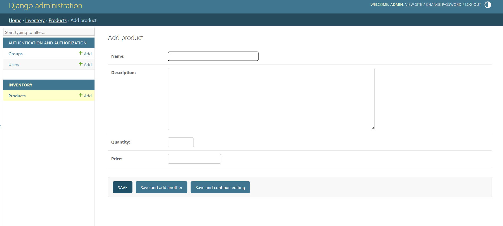
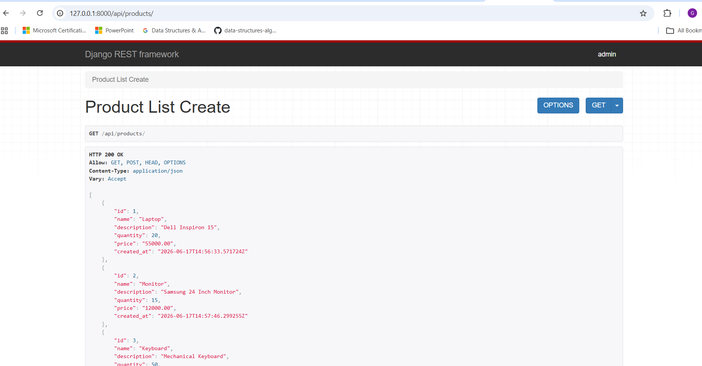
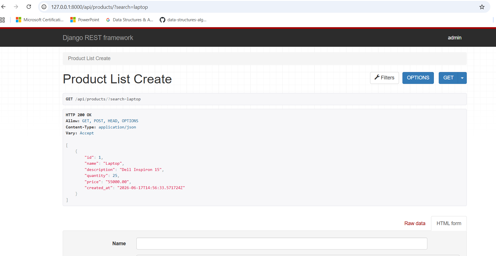
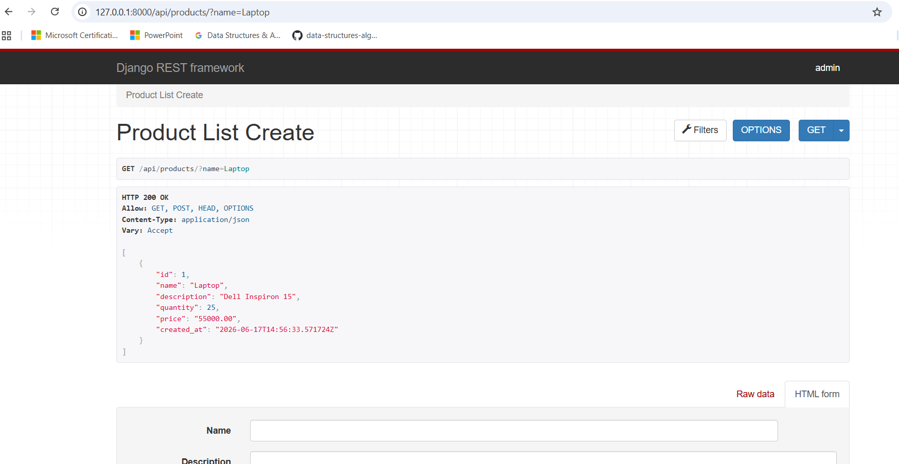

# Inventory Management API

A RESTful Inventory Management API built with Django and Django REST Framework.

This project allows users to manage inventory products through secure API endpoints with support for CRUD operations, filtering, search functionality, and token-based authentication.

## Features

* Create, Read, Update, and Delete products
* Product management through Django Admin
* REST API built with Django REST Framework
* Search products by name and description
* Filter products by name
* Token Authentication
* JSON API responses
* SQLite database integration

## Tech Stack

* Python
* Django
* Django REST Framework
* SQLite
* Django Filter
* Token Authentication
* Git & GitHub

## API Endpoints

### Products

GET

/api/products/

Retrieve all products.

### Product Details

GET

/api/products/<id>/

Retrieve a single product.

### Search Products

/api/products/?search=laptop

Search products by name or description.

### Filter Products

/api/products/?name=Laptop

Filter products by exact product name.

### Authentication Token

/api/token/

Generate authentication token.

## Project Structure

inventory-management-api/

├── inventory/

├── inventory_api/

├── manage.py

├── requirements.txt

├── README.md

└── screenshots/

## Screenshots

### Django Admin

### Product API

### Product Search

### Product Filtering

## Sample Product JSON

{
"id": 1,
"name": "Laptop",
"description": "Dell Inspiron Laptop",
"price": "55000.00",
"quantity": 10
}

## How to Run

1. Clone repository

git clone <repository-url>

2. Create virtual environment

python -m venv venv

3. Activate virtual environment

Windows:

venv\Scripts\Activate.ps1

4. Install dependencies

pip install -r requirements.txt

5. Run migrations

python manage.py migrate

6. Start server

python manage.py runserver

## Future Improvements

* Docker Support
* API Documentation (Swagger)
* Deployment to Cloud
* Automated Testing
* Role-Based Access Control

## Author

Girish Katare

Python Developer Portfolio Project
